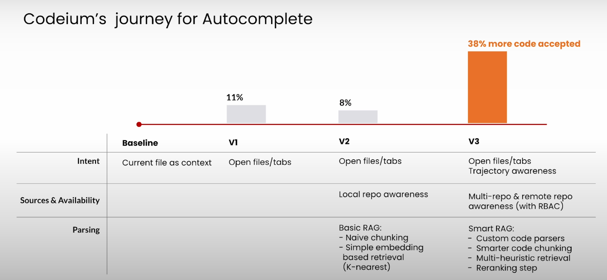

# Build Apps with Windsurf’s AI Coding Agents- Coursera
Build windsurf as a collaborative agent that bridges the gap between simple assitants and autonomous coding agents. The difference between major AI coding assitants is **how they use LLM in their flow to plan and execute actions**.
 
1. It keeps track of the human actions. Let's say it was working on some problem and in between you made changes in a file. On accept, it automatically identify your changes and adapt the solution just like working with a peer.
2. Reasoning Models and why they are note enough for great experience
    - Context Awareness- Not just the access of knowledge, but also how you preprocess and reason over it.
        - Axis of Context Awareness- Sources, Parsing and Access.
    - Human Actions- Understandin human actions allow deeper understanding of user intent
3. Takeaways
    - Context awareness bring explicit knowledge
    - Human Actions bring implicit intent

**Search and Discovery for AI Agents**
1. Why search and discovery for code? Code writing requires search across the current codebase, documents and there are many ways to achieve the same code task.
2. Multi-step retrieval- Like humans, it fetches and reason multiple times.
3. Search and discovery problem
    - We know what we want and where to retrieve it from. grep, listdir Ex. "Find all the call sites of Animal class"
    - We know what we want but we don't know where to get it. Web Search and MCP Ex. "Find the code sample publicly which solves the knapsack problem"
    - We don't exactly know what we want. Embedding search Ex. "I need all the relevant information to build a new ContactForm object"
        - We lose some information when using embedding. Also, **Larger Model!=Better Retrieval** as per MTEB benchmark.
        - These benchmarks use needle in a haystack approach. Evaluation based on on retrieval. In the product scenario, we can have multiple retrieval and focus on recall. Recall-40
4. Commit message Bank dataset- Utilize commit message and the files changed to create Product-led Benchmark.
    - Embedding based method has **high false positive rate**.
    - Riptide- Move away from embedding space. Use more compute. Take all the code snippets of the codebase and ask whether the given snippet is relevant to the query. Re-ranking done. It outperformed all the approaches.

**Axis to improve your user experience**
1. Capabilites- When to use these AI capabilites-
2. Guidance- The better you are guidance, better the results.
3. Observability- Observe what AI is doing
4. Polish-

**Hand-on Tips**
1. You can setup global level settings. Ex. Mention to use python3 instead of python all the time.
2. Caching- Ex. "Create a local cache for the page results so that we are not rerunning the retrieval for the same page"
3. Revert the conversation and the code changes instead of spending time on fine tuning the improper code.
4. Edit inside a file- Use Ctrl+I to call the casecade inside that file. Other funtionalties include AutoCorrect, Suggestions etc.
5. '@' point to functions, methods in casecade to give direction and scope.
6. Multimodal input- You can attach an image along with instruction in cascade.
7. Cascade Commands Allow list- Allow commands for auto execution. Whitelist/Blacklist/Turbo mode. 

## 💻 &nbsp; Prompts for lessons 7-10:

**📚 &nbsp; L7: Wikipedia Analysis App – Data Analysis**

Write a script that takes in a wikipedia category as a command line argument and outputs the cumulative frequency of non-common words across all of the pages in that category, and then run it on "Large_language_models." Use the MediaWiki API.

**📚 &nbsp; L8: Wikipedia Analysis App – Caching**

[First prompt] Create a local cache of page results so that we aren't rerunning the retrieval logic for the same category
[Second prompt] Create a local cache of the script's results so that we aren't rerunning the processing logic for the same category

**📚 &nbsp; L9: Wikipedia Analysis App – Fullstack App**

Create a webpage that loads from the results cache (if available, otherwise computes the frequencies from scratch) and displays a word cloud where the sizes of the words are proportional to frequency. Use HTML, javascript, and Flask.
[Command] create a ColorPalette class that would contain 6 hex colors, and a bunch of common color palettes that extend the class

Integrate @get_all_color_palettes into the word cloud app. Make the color palettes selectable in a drop down and display the colors being used.

**📚 &nbsp; L10: Wikipedia Analysis App – Polish**

Add raw frequencies to the app as shown in the image.

## 🧑‍💻 &nbsp; Repos used in the course

**📚 &nbsp; L3 Repo – Fixing Tests Automatically**

- https://github.com/Exafunction/windsurf-demo

**📚 &nbsp; L6 Repo – Understanding Large Codebases**

- https://github.com/ddd-by-examples/library

# References
1. https://learn.deeplearning.ai/courses/build-apps-with-windsurfs-ai-coding-agents/lesson/ym8if/introduction?courseName=build-apps-with-windsurfs-ai-coding-agents