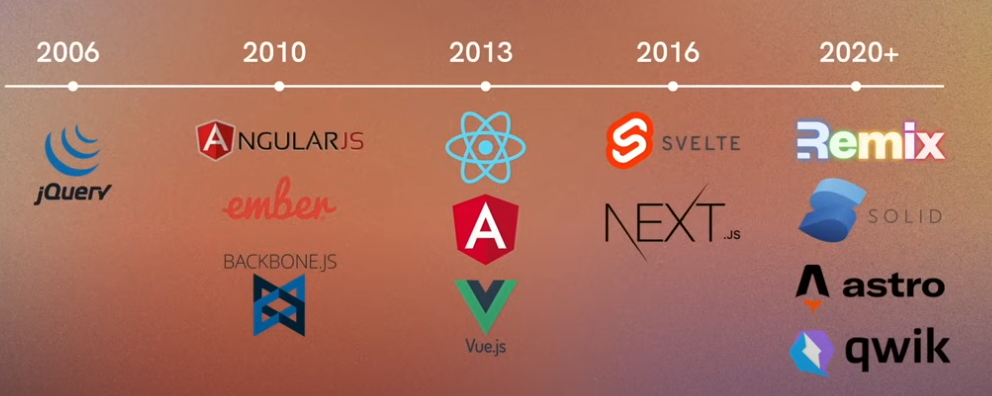

## Local setup with Vibe

```
# check node version- v22.13.1
node -v
# check npm version- 9.8.0
npm -v

npm create vite@latest
cd first-react
npm install
npm run dev
```
## Library vs Framework
Library is a resuable code whereas framework is a pre determined architecture- you follow a specified pattern of development. Library usage is dependent on you whereas framework has a right or wrong ways to use it. 

React is Javascript library!


## JSX
Syntactic sugar on top of `createElement`

## Why React
1. Composable- Can create easily reusable and interchangable "pieces of the web" that can be combined to create complex systems
2. Components- A functon that returns React elements. Custom component.
3. Declaraive- Just tells "What should be done"

## Custom Components
1. Pascal case, Inside angle brackets '< />'

## Fragment
Difference instead of <div>, Fragment will not create another nested dom element. Instead of importing `Fragment`, we can just use `<> </>`